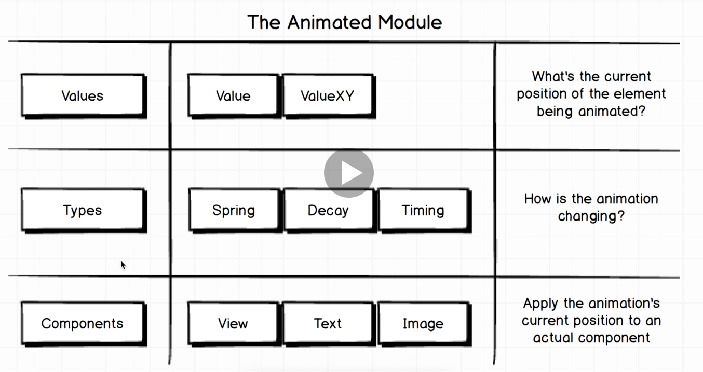

1. Move Ball 
This is amde using animated api of react native. This is purely functionaly component.

A. Animated system

Always ask these 3 questions before starting aniamtions

    1. Where is element to animate right now. Exact X,Y positions.
    2. Where is this element moving?
    3. Which element are we moving?

    For example if want to move ball from top to bottom ans would be
    1. It is at 200,500
    2. It will move downwards
    3. It is a ball

B. Pan responder system
     1. What are we touching?
     2. What component handles touche?
     3. How is gesture changing?   
     
     
     
     
